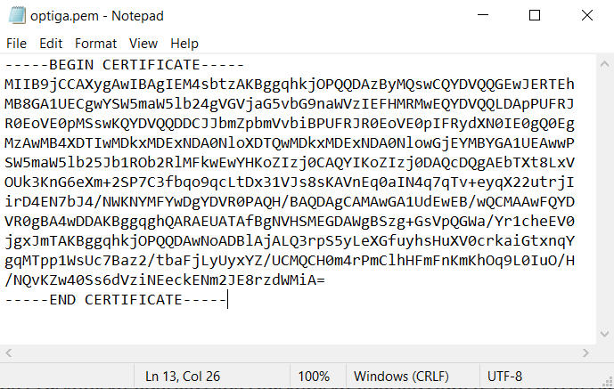
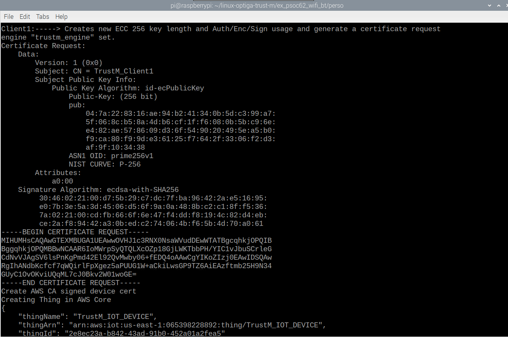

# Infineon  "Secured IOT Connectivity Kit"for CyberSecurity Labeling Scheme

1. [About](#about)
    * [Prerequisites](#prerequisites)
3. [Set up the Development Environment](#set_up_env)
4. [Set up your AWS account and Permissions](#set_up_aws)
5. [Import the project into ModusToolbox](#import)
6. [Create AWS IoT Thing on AWS IOT console](#create_thing)
7. [Configure and Run the FreeRTOS](#config)
    * [Using the pre-provisioned key and certificate](#pre-provision)
    * [Using your own key and Certificate(Using PSoC62)](#gen_key)
    * [Using your own key and Certificate(Using Raspberry pi to auto provision to aws](#auto_gen)

## <a name="about"></a>About

The PSoC62 Wi-Fi BT Prototyping Kit (CY8CPROTO-062-4343W) is a low-cost hardware platform that enables design and debug of PSoC 6 MCUs with FreeRTOS and AWS IoT integration. The Cypress PSoC 62 is purpose-built for the IoT, delivering the industry’s lowest power, most flexibility, and built-in security for the IoT.It delivers a dual-core platform with a 150-MHz Arm® Cortex®-M4 as the primary application processor and an 100-MHz Arm Cortex-M0+ as the secondary processor for low-power operation. The kit comes with a PSoC 62 MCU with 2MB of Flash /1MB of SRAM memory, industry-leading CapSense® for touch buttons and slider,on-board debugger/programmer with KitProg3, MicroSD card interface, 512-Mb Quad-SPI NOR flash, PDM microphone, and a thermistor. For wireless connectivity, including dual-band Wi-Fi, it also provides an on-board MurataLBEE5KL1DX module built on the Cypress CYW4343W Wi-Fi / Bluetooth single-chip solution.

The PSOC can be paired with OPTIGA™ Trust M to enable protection of sensitive security tokens on the device, such as X.509 certificates and private keys.

### <a name="prerequisites"></a>Prerequisites

Following is the software tools required :

- [ModusToolbox software](https://www.cypress.com/products/modustoolbox)

Hardware platforms and boards:

- [Infineon’s PSoC62  Wi-Fi BT Prototyping Kit](https://www.cypress.com/documentation/development-kitsboards/psoc-6-wi-fi-bt-prototyping-kit-cy8cproto-062-4343w)

- [OPTIGA™ Trust M](https://www.infineon.com/cms/en/product/evaluation-boards/s2go-security-optiga-m/)

- PSoC62 adaptor board

  

Connect the KitProg3 USB port to computer.

## <a name="set_up_env"></a>Set up the Development Environment 

### <a name="install_mtb"></a>Install ModusToolbox  

FreeRTOS works with either a CMake or Make build flow. You can use ModusToolbox for your Make build flow. You can use the Eclipse IDE delivered with ModusToolbox. The Eclipse IDE is compatible with the Windows, macOS, andLinux operating systems.

Before youbegin, download and install the latest [ModusToolbox software](https://www.cypress.com/products/modustoolbox). For more information, see the [ModusToolbox Installation Guide](https://www.cypress.com/ModusToolboxInstallGuide).

## <a name="set_up_aws"></a>Set up your AWS account and Permissions 

To create an AWS account, see [Create and Activate an AWS Account](https://aws.amazon.com/premiumsupport/knowledge-center/create-and-activate-aws-account/).

Toadd an IAM user to your AWS account, see [IAM User Guide](https://docs.aws.amazon.com/IAM/latest/UserGuide/). To grant your IAM user account access to AWS IoT and FreeRTOS, attach the following IAM policies to your IAM user account:

- AmazonFreeRTOSFullAccess
- AWSIoTFullAccess

**To attach theAmazonFreeRTOSFullAccess policy to your IAM user**

1. Browse to the [IAM console](https://console.aws.amazon.com/iam/home), and from the navigation pane, choose **Users**.
2. Enter your user name in the search text     box, and then choose it from the list.
3. Choose **Add permissions**.
4. Choose **Attach existing policies     directly**.
5. In the search box, enter **AmazonFreeRTOSFullAccess**,     choose it from the list, and then choose **Next: Review**.
6. Choose **Add permissions**.

**To attach theAWSIoTFullAccess policy to your IAM user**

1. Browse to the [IAM console](https://console.aws.amazon.com/iam/home), and from the navigation pane, choose **Users**.
2. Enter your user name in the search text     box, and then choose it from the list.
3. Choose **Add permissions**.
4. Choose **Attach existing policies     directly**.
5. In the search box, enter **AWSIoTFullAccess**,     choose it from the list, and then choose **Next: Review**.
6. Choose **Add permissions**.

For more information aboutIAM and user accounts, see [IAM User Guide](https://docs.aws.amazon.com/IAM/latest/UserGuide/).

For more information about policies, see [IAM Permissionsand Policies](https://docs.aws.amazon.com/IAM/latest/UserGuide/introduction_access-management.html).

## <a name="import"></a>Import the project into ModusToolbox

1. Open the Eclipse IDE for ModusToolbox and choose, or create, a     workspace 
2. In ModusToolbox, choose **File**, and then choose **Import**.     Click **ModusToolbox Application     Import**, then choose **Next**. 
3. In the **Import****Eclipse IDE for ModusToolbox Project** window, choose **Browse**,In the directory where you unzipped your FreeRTOS download, the demo project islocated in located at \projects\cypress\CY8CPROTO_062_4343W\mtb\aws_demos
4. Choose **Finish** to import the project into your workspace 
5. The `aws_demos` project should be imported into your workspace.

## <a name="create_thing"></a>Create AWS IoT Thing on AWS IOT console

1. Browse to the [AWS IoT console](https://console.aws.amazon.com/iotv2/).

2. In the navigation pane, choose **Manage**, and then choose **Things**.

3. If you do not have any IoT things registered in your account,the **You don't have any things yet** page is displayed. If yousee this page, choose **Register a thing**. Otherwise, choose **Create**.

4. On the **Creating AWS IoT things** page,choose **Create a single thing**.

5. On the **Add your device to the thing registry** page,enter a name for your thing, and then choose **Next**.

6. On the **Create a Certificate** Page, choose **Use my certificate**

7. Select **Next**

8. Then on next page(**Register existing device certificates**), click **Select Certificate** and point to the location in local machine where optiga.pem(or deviceCert.pem) is stored

**NOTE: For the certificate export/generation, Please refer to or .Please skip Register CA if you are using pre-provision certificate.**

9.    Click on **Activate all** button and then click on **Register certificates**

10.    You will be redirected to Certificates section

11.    Go to **Secure\ Policies** section, click oncreate button, give a name and click on advanced mode

12.    Then pastethe following policy and click on **create**:

{

  "Version":"2012-10-17",

  "Statement": [

​    {

​      "Action":[

​        "iot:*"

​      ],

​     "Resource": [

​        "*"

​      ],

​      "Effect":"Allow"

​    }

  ]

}

13.  Go back to **Secure\ Certificate** section

14.  Open the certificate provisioned, click on **Actions** and click **Attach Policy**

15.  Find the policy name that you created and click on **Attach**

## <a name="config"></a>Configure and Run the FreeRTOS 

### <a name="pre-provision"></a>Using the pre-provisioned key and certificate 

#### <a name="initial-config"></a>Initial Configuration

Perform the steps in [Configuring the FreeRTOS Demos](https://github.com/Infineon/amazon-freertos/blob/feature/trustm/vendors/infineon/boards/xmc4800_plus_optiga_trust_m/freertos-configure.md), but skip the last step (that is, don’t do *To format your AWS IoT credentials*).The net result should be that the `demos/include/aws_clientcredential.h` file has been updated with settings, but the `demos/include/aws_clientcredential_keys.h` file has not.

The OPTIGA Trust M comes pre-provisioned with a certificate signed with Infineon's    OPTIGA(TM)Trust M CA and a private key, and can make use of the [AWS IoT Multi-Account Registration](https://aws.amazon.com/about-aws/whats-new/2020/04/simplify-iot-device-registration-and-easily-move-devices-between-aws-accounts-with-aws-iot-core-multi-account-registration/) feature. To retrieve the certificate from the OPTIGA Trust M, and register it with AWS IoT using Multi-Account Registration, follow the instructions below.

#### <a name="read-cert"></a>Read out the pre-provision cert from Trust M

**NOTE:** if you do have Shield2Go Security OPTIGA™ Trust M and there is no QR code on your package follow the steps mentioned [here](#run_project), to read out your certificate and continue with the "Register the certificate with AWS IoT" step

Download the certificate from the OPTIGA™ Trust M with Infineon Toolbox

If you have the [Shield2Go Cloud Security OPTIGA™Trust M](https://www.infineon.com/cms/en/product/evaluation-boards/s2go-cloud-optiga-m/) variant, you can obtain the certificate that is pre-loaded on the secure element with the [InfineonToolbox](https://softwaretools.infineon.com/). Follow the steps below to retrieve your certificate:

1. Under **First Steps** choose **please register**.
2. If you have a QR Code, choose **Scan QR code** andfollow the instructions. Otherwise, if you have the Serial number, choose **Enter SerialNumber** and enter the Serial Number on the next page.
3. After inputting your serial number or QR code, the Shield2GoCloud Security OPTIGA™ Trust M should appear in the browser. Choose **View Details**.
4. The public X.509 certificate that is present on your device should be displayed. Copy or download this certificate to your local environment.

#### <a name="config-pkcs"></a>Configure PKCS#11 on FreeRTOS 

The certificate is already pre-loaded on the OPTIGA™ Trust M, you will not need to add the certificate to the FreeRTOS code. Instead, you will specify the PKCS#11labels for the OPTIGA™ Trust M's certificate and private key slots.

Open thefile                                    

\vendors\cypress\boards\CY8CPROTO_062_4343W\aws_demos\config_files\iot_pkcs11_config.h

1. Set pkcs11configLABEL_DEVICE_PRIVATE_KEY_FOR_TLS to 0xE0F0 
2. Set pkcs11configLABEL_DEVICE_CERTIFICATE_FOR_TLS to 0xE0E0 
3. Set pkcs11configLABEL_JITP_CERTIFICATE to 0xE0E0 
4. Open the file demos/include/aws_clientcredential_keys.h.
5. Ensure keyJITR_DEVICE_CERTIFICATE_AUTHORITY_PEM, keyCLIENT_CERTIFICATE_PEM, and keyCLIENT_PRIVATE_KEY_PEM are set to ""

#### <a name="build-app"></a>Build the application 

From the **Quick Panel**, select **Build aws_demos Application**.

Choose **Project** and choose **Build All**.

Make sure the project compiles without errors.

#### **<a name="setup-serial"></a>Setup a serial connection**

a.    Connect the kit to your host computer shown in Chapter 2.

b.    The USB Serial port for the kit is automatically enumerated on the host computer.Identify the port number. In Windows, you can identify it using the **Device Manager** under **Ports** (COM & LPT).

c.     Start aserial terminal and open a connection with the following settings:

·       Baud rate:115200

·       Data: 8 bit

·       Parity: None

·       Stop bits: 1

·       Flow control:None

#### <a name="run_project"></a>Run the FreeRTOS demo project

a.    Select the project aws_demos in the workspace.

b.    From the **Quick Panel**, select **aws_demos Program (KitProg3)**.This programs the board and the demo application starts running after the programming is finished.

c.     You can view the status of the running application in the serial terminal. The following figure shows a part of the terminal output.


Copy these lines into notepad and save it as optiga.pem



Register this certificate to aws IoT console.

You can use the MQTT client in the AWS IoT console to monitor the messages that your device sends to the AWS Cloud. You might want to set this up before the device runs the demo project.

**To subscribe to the MQTT topic with the AWS IoT MQTT client**

1.    Sign in to the [AWS IoT console](https://console.aws.amazon.com/iotv2/).
2.    In the navigation pane, choose **Test** toopen the MQTT client.
3.    In **Subscription topic**, enter **iotdemo/topic/#**, and then choose **Subscribe to topic**.


### <a name="gen_key"></a>Using your own key and Certificate(Using PSoC62)

To generate your own device key pair and certificate securely, please follow the instructions below:

#### <a name="key-selection"></a>Key slot selection

There are three key slots to select for key generation and certificate store, you can choose the key slot you want to use by changing the setting below:

Open the file: 

\vendors\cypress\boards\CY8CPROTO_062_4343W\aws_demos\config_files\iot_pkcs11_config.h

1.    Set pkcs11configLABEL_DEVICE_PRIVATE_KEY_FOR_TLS to 0xE0F1(or 0xE0F2)
2.    Set pkcs11configLABEL_DEVICE_CERTIFICATE_FOR_TLS to 0xE0E1(or 0xE0E2) 
3.    Set pkcs11configLABEL_JITP_CERTIFICATE to 0xE0E1(or 0xE0E2)

#### <a name="project-config"></a>Demo Project Configuration

In the project, open the file aws_dev_mode_key_provisioning.c and change the definition of keyprovisioningFORCE_GENERATE_NEW_KEY_PAIR, which is set to zero by default, to one:

**#define keyprovisioningFORCE_GENERATE_NEW_KEY_PAIR1**

 Then build and run the demo project and continue to the next step.

#### <a name="extract-pubkey"></a>Public Key Extraction

Since the device has not yet been provisioned with a private key and client certificate, the demo will fail to authenticate to AWS IoT. However, the Hello World MQTT demo starts by running developer-mode key provisioning, resulting in the creation of a private key if one was not already present. Example output on the serial console is given below: 

7 910 [IP-task] Device public key, 91 bytes:

3059 3013 0607 2a86 48ce 3d02 0106 082a

8648 ce3d 0301 0703 4200 04cd 6569 ceb8

1bb9 1e72 339f e8cf 60ef 0f9f b473 33ac

6f19 1813 6999 3fa0 c293 5fae 08f1 1ad0

41b7 345c e746 1046 228e 5a5f d787 d571

dcb2 4e8d 75b3 2586 e2cc 0c

Copy the six lines of key bytes into a file called `DevicePublicKeyAsciiHex.txt`. Then use the command-line tool "xxd" to parse the hex bytes into binary:

```
xxd -r -ps DevicePublicKeyAsciiHex.txt DevicePublicKeyDer.bin
```

Use "openssl" to format the binary encoded (DER)device public key as PEM:

```
openssl ec -inform der -in DevicePublicKeyDer.bin -pubin -pubout -outform pem -out DevicePublicKey.pem
```

#### <a name="disable-marco"></a>Disable Macro

Next step is to disable the temporary key generation setting you enabled above. Otherwise, the device will create another key pair, and you will have to repeat the previous steps:

```
#define keyprovisioningFORCE_GENERATE_NEW_KEY_PAIR 0   
```

NOTE: Remember to disable this marco and flash into PSoC62 before power off this kits to avoid recreating new keypair.   

#### <a name="setup-pki"></a>Public Key Infrastructure Setup

Follow the instructions in Registering Your CA Certificate to create a certificate hierarchy for your device lab certificate. Stop before executing the sequence described in the section Creating a Device Certificate Using Your CA Certificate. 

In this case, the device will not be signing the certificate request (that is, the Certificate Service Request or CSR) because the X.509 encoding logic required for creating and signing a CSR has been excluded from the FreeRTOS demo projects to reduce ROM size. Instead, for lab testing purposes, create a private key on your workstation and use it to sign the CSR.

```
 openssl genrsa -out tempCsrSigner.key 2048
```

```
 openssl req -new -key tempCsrSigner.key -out deviceCert.csr
```

Once your Certificate Authority has been created and registered with AWS IoT, use the following command to issue a client certificate based on the device CSR that was signed in the previous step:

```
openssl x509 -req -in deviceCert.csr -CA rootCA.pem -CAkey rootCA.key -CAcreateserial -out deviceCert.pem -days 500 -sha256 -force_pubkey DevicePublicKey.pem  
```

Even though the CSR was signed with a temporary private key, the issued certificate can only be used with the actual device private key. The same mechanism can be used in production if you store the CSR signer key in separate hardware, and configure your certificate authority so that it only issues certificates for requests that have been signed by that specific key. That key should also remain under the control of a designated administrator.

#### <a name="import-cert"></a>Certificate Import

With the certificate issued, the next step is to import it into your device. 

In the `**aws_clientcredential_keys.h**` filein your project, set 

the `**keyCLIENT_CERTIFICATE_PEM**` macroto be the contents of deviceCert.pem 

**To format the certificate for** aws_clientcredential_keys.h****

1.     In a browser window,open `/tools/certificate_configuration/CertificateConfigurator.html`.

2.     Under **Certificate PEMfile**, choose deviceCert.pem.

3.     Choose **Generate andsave aws_clientcredential_keys.h**

Copy the below part into **aws_clientcredential_keys.h** in `/demos/include.`


Disable this macro in original **aws_clientcredential_keys.h** in `/demos/include`and save this file.

```
#define keyCLIENT_CERTIFICATE_PEM                   ""
```

Repeat the steps described above to build and run the project. 

### <a name="auto_gen"></a>Using your own key and Certificate(Using Raspberry pi to auto provision to aws)

There is another easy way to auto register trust m to aws using your own key and Certificate.

For first time setup, follow instructions up to section “3.1 Policy Registration on AWS IOT console”

#### <a name="auto_gen_key"></a>Auto provision to aws using Raspberry Pi

Change the policy name in the psoc62_auto_provision_to_aws.sh script located in **linux-optiga-trust-m/**
**ex_psoc62_wifi_bt/perso** folder to match to the policy name you created in AWS IoT console.

Note: Make sure the policy is already created in AWS IOT console and the policy name matches the name inside psoc62_auto_provision_to_aws.sh script before running the script.

Running the script:

`pi@raspberrypi:~/linux-optiga-trust-m/ex_psoc62_wifi_bt/perso $ sh psoc62_auto_provision_to_aws.sh`

The output is shown as below as example:



#### <a name="psoc62_keyslot"></a>Key slot selection in PSoC62 project

There are three key slots to select for key generation and certificate store, you can choose the key slot you want to use by changing the setting below:

Open the file: 

\vendors\cypress\boards\CY8CPROTO_062_4343W\aws_demos\config_files\iot_pkcs11_config.h

1.    Set pkcs11configLABEL_DEVICE_PRIVATE_KEY_FOR_TLS to 0xE0F1(or 0xE0F2)

2.    Set pkcs11configLABEL_DEVICE_CERTIFICATE_FOR_TLS to 0xE0E1(or 0xE0E2) 

3.    Set pkcs11configLABEL_JITP_CERTIFICATE to 0xE0E1(or 0xE0E2)

Note: 

1        Make sure the key slot you use is same with the one you use in the psoc62_auto_provision_to_aws.sh script located in **linux-optiga-trust-m/ex_psoc62_wifi_bt/perso** folder 

2        Make sure the thing name you use is same with the one you use in the psoc62_auto_provision_to_aws.sh script located in **linux-optiga-trust-m/ex_psoc62_wifi_bt/perso** folder 

Power off and Plug out OPTIGA Trust M Shield2GO board from Raspberry Pi and plug it into PSoC62 platform.
